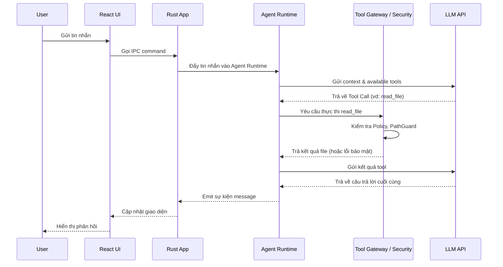

# Kiến trúc Hệ thống Hubbub (System Architecture)

Dự án Hubbub là một ứng dụng Personal Multi-Agent Chat App được xây dựng với Tauri 2 + React + Rust Core. Dưới đây là tài liệu chi tiết về kiến trúc của hệ thống.

## Sơ đồ Kiến trúc Cấp cao (High-level Architecture)

```text
+-------------------------------------------------------------+
|                      User Interface (React)                 |
+-------------------------------------------------------------+
                              | (IPC)
+-------------------------------------------------------------+
|                      Tauri Shell                            |
+-------------------------------------------------------------+
                              |
+-------------------------------------------------------------+
|                     Application Layer                       |
|   (App Services, Use Cases, Command/Query handlers)         |
+-------------------------------------------------------------+
                              |
+-------------------------------------------------------------+
|        Agent System      |       Security Architecture      |
| (Runtime, Tools, Memory) | (Policy Engine, Path/UrlGuard)   |
+-------------------------------------------------------------+
                              |
+-------------------------------------------------------------+
|                       Domain Layer                          |
|   (Entities, Value Objects, Business Rules, Ports/Traits)   |
+-------------------------------------------------------------+
                              |
+-------------------------------------------------------------+
|                  Infrastructure (Adapters)                  |
| (SQLite FTS5, File System, LLM APIs, Web Clients, MCP)      |
+-------------------------------------------------------------+
```

## Kiến trúc Phân lớp (Layered Architecture)

Hệ thống tuân thủ **Clean/Hexagonal Architecture** với các lớp từ ngoài vào trong:

1. **UI (React)**: Giao diện người dùng.
2. **Tauri Shell**: Quản lý vòng đời ứng dụng máy tính, giao tiếp IPC.
3. **Application**: Điều phối luồng dữ liệu, thực thi use cases.
4. **Agent / Security**: Các thành phần xử lý logic AI và bảo vệ hệ thống.
5. **Domain**: Chứa các business model cốt lõi. Không phụ thuộc vào bất kỳ framework hay thư viện I/O nào.
6. **Infrastructure**: Implement các trait (port) của Domain, tương tác trực tiếp với Database, OS, Network.

### Quy tắc Phụ thuộc (Dependency Rules)
* `domain` ← `policy`, `agent`, `adapters` ← `app` ← `tauri shell`.
* Các module `domain`, `policy`, `agent` **TUYỆT ĐỐI KHÔNG** import các crate I/O (như `std::fs`, `reqwest`, `sqlx`). Mọi tác vụ I/O phải thông qua các Port/Trait được định nghĩa tại Domain.

## Luồng Dữ liệu (Data Flow Diagram)



## Mô tả Các Module (Module Descriptions)

* **domain**: Cấu trúc dữ liệu lõi, định nghĩa Trait (Port).
* **policy**: Hệ thống luật bảo mật (Policy Engine), quyết định quyền truy cập mạng/tệp.
* **agent**: Core runtime cho AI agents, vòng lặp orchestrate và delegation.
* **llm**: Client giao tiếp với các mô hình ngôn ngữ (OpenAI, Anthropic).
* **tools**: Các công cụ (read_file, web_search, ...) mà agent có thể sử dụng.
* **mcp**: Model Context Protocol (MCP) clients để mở rộng capabilities của agent.
* **store**: Persistence layer, xử lý lưu trữ vào SQLite.
* **workspace**: Quản lý thư mục làm việc, file, indexing.
* **vault**: Quản lý an toàn các API keys và secrets.
* **app**: Lớp điều phối tổng thể, liên kết domain với các adapter cụ thể.

## Tổng quan Lược đồ Cơ sở dữ liệu (Database Schema)
Sử dụng **SQLite** với tính năng **FTS5** (Full-Text Search).

* `conversations`: Lưu thông tin các phiên chat.
* `messages`: Lưu nội dung chat, role (user, assistant, tool). Đã index FTS5 để tìm kiếm.
* `runs`: Theo dõi quá trình thực thi của agent (start_time, end_time, status).
* `steps`: Các bước trong một run (tool_call, llm_response).
* `documents`: Bảng lưu trữ nội dung file/tài liệu trong workspace kèm index FTS5.
* `audit_log`: Ghi nhận các hành động nguy hiểm (truy cập mạng, thay đổi file system) dùng cho mục đích security audit.

## Cấu trúc Thư mục Workspace (Filesystem Layout)
```text
~/.hubbub/
├── config.toml           # Cấu hình app
├── vault.key             # (Hoặc keyring OS) để mã hóa secrets
├── db/
│   └── hubbub.sqlite     # CSDL chính
└── agents/               # Cấu hình Agents (chỉ đọc với công cụ của agent)
Workspace của User/
├── (Các dự án và tệp tin của người dùng)
└── .hubbub_meta/         # (Tùy chọn) Metadata cho từng workspace riêng
```

## Kiến trúc Bảo mật (Security Architecture)

Mọi Tool Call từ Agent đều phải đi qua **Tool Gateway**, nơi kích hoạt **Policy Engine**:
* **PathGuard**: Xác thực đường dẫn (ngăn chặn `../` path traversal, symlink escape).
* **UrlGuard**: Xác thực URL cho các yêu cầu web (chặn Private IP/SSRF, giới hạn kích thước).

## Hệ thống Agent (Agent System)
* **Runtime Loop**: Xử lý state machine của Agent (Pending -> Running -> Tool Execution -> Completed/Failed).
* **Orchestration**: Quản lý bộ nhớ ngữ cảnh, tóm tắt khi vượt quá token limit.
* **Delegation**: Một Agent chính (Router) có thể delegate nhiệm vụ cho các Sub-Agent chuyên biệt (Ví dụ: Coder Agent, Researcher Agent).

## Bảng Tóm tắt Tech Stack

| Thành phần | Công nghệ / Thư viện |
| :--- | :--- |
| **Desktop Framework** | Tauri 2 |
| **Frontend** | React 19, TypeScript, Vite, TailwindCSS |
| **Backend / Core** | Rust, Tokio (Async) |
| **Database** | SQLite, sqlx (Async, compile-time checked), FTS5 |
| **AI Integration** | `async-openai` (hoặc custom REST clients), FakeLlm cho Test |
| **Security** | Capability-based security, PathGuard, UrlGuard |
